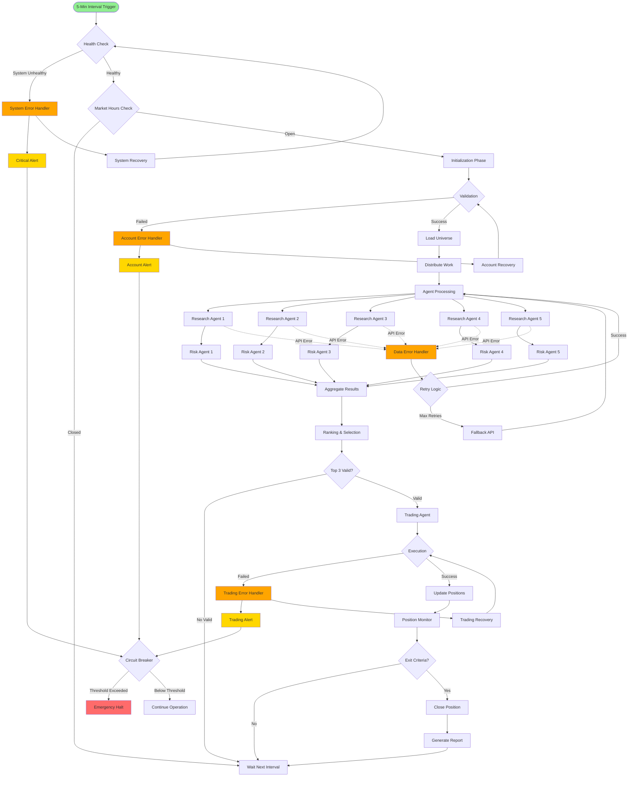

# Iron Butterfly Strategy Automation - Enhanced PRD with Complete Node Architecture

## Executive Summary

This Product Requirements Document (PRD) outlines the design and implementation of an automated Iron Butterfly options trading strategy using n8n workflow automation with **native n8n nodes and MCP (Model Context Protocol) tools**. The system will identify, analyze, and execute Iron Butterfly trades with minimal human intervention while maintaining robust risk management through comprehensive error handling and edge case management. State management is handled through Supabase PostgreSQL database for reliable, scalable persistence.

### Key Objectives
- Automate the complete Iron Butterfly strategy lifecycle from screening to execution **using n8n native nodes**
- Implement **AI Agent nodes with MCP tool integration** for distributed analysis and risk assessment
- Achieve 18-30% annual returns with maximum 15% drawdown
- Execute trades via **AI Agent nodes equipped with Alpaca MCP server tools** (no direct API scripts)
- Maintain 5-minute monitoring intervals with real-time risk controls
- **Replace all custom JavaScript functions with n8n built-in nodes where possible**
- **Handle all error cases and edge scenarios with resilient recovery mechanisms**

## Supabase Database Schema

### Required Tables

```sql
-- Workflow state management
CREATE TABLE workflow_state (
  id UUID DEFAULT gen_random_uuid() PRIMARY KEY,
  key VARCHAR(255) UNIQUE NOT NULL,
  value JSONB NOT NULL,
  expires_at TIMESTAMP,
  created_at TIMESTAMP DEFAULT NOW(),
  updated_at TIMESTAMP DEFAULT NOW()
);

-- Positions tracking
CREATE TABLE positions (
  id UUID DEFAULT gen_random_uuid() PRIMARY KEY,
  symbol VARCHAR(10) NOT NULL,
  position_type VARCHAR(20) DEFAULT 'IRON_BUTTERFLY',
  entry_date TIMESTAMP NOT NULL,
  expiry_date DATE NOT NULL,
  atm_strike DECIMAL(10,2) NOT NULL,
  short_call_strike DECIMAL(10,2) NOT NULL,
  short_put_strike DECIMAL(10,2) NOT NULL,
  long_call_strike DECIMAL(10,2) NOT NULL,
  long_put_strike DECIMAL(10,2) NOT NULL,
  entry_credit DECIMAL(10,2) NOT NULL,
  max_loss DECIMAL(10,2) NOT NULL,
  entry_delta DECIMAL(6,4),
  entry_theta DECIMAL(6,4),
  entry_iv DECIMAL(6,4),
  status VARCHAR(20) DEFAULT 'OPEN',
  closed_date TIMESTAMP,
  closed_price DECIMAL(10,2),
  realized_pnl DECIMAL(10,2),
  close_reason VARCHAR(100),
  created_at TIMESTAMP DEFAULT NOW(),
  updated_at TIMESTAMP DEFAULT NOW()
);

-- Trade opportunities analysis
CREATE TABLE trade_opportunities (
  id UUID DEFAULT gen_random_uuid() PRIMARY KEY,
  symbol VARCHAR(10) NOT NULL,
  analysis_date TIMESTAMP NOT NULL,
  research_score DECIMAL(5,2),
  risk_score DECIMAL(5,2),
  composite_score DECIMAL(5,2),
  credit_received DECIMAL(10,2),
  max_loss DECIMAL(10,2),
  delta DECIMAL(6,4),
  theta DECIMAL(6,4),
  iv_rank DECIMAL(5,2),
  liquidity_score DECIMAL(5,2),
  selected BOOLEAN DEFAULT FALSE,
  execution_status VARCHAR(20),
  created_at TIMESTAMP DEFAULT NOW()
);

-- Error and recovery logs
CREATE TABLE error_logs (
  id UUID DEFAULT gen_random_uuid() PRIMARY KEY,
  error_type VARCHAR(50) NOT NULL,
  error_message TEXT,
  error_context JSONB,
  severity VARCHAR(20),
  recovery_action VARCHAR(100),
  resolved BOOLEAN DEFAULT FALSE,
  created_at TIMESTAMP DEFAULT NOW()
);

-- API rate limiting and circuit breaker
CREATE TABLE api_health (
  id UUID DEFAULT gen_random_uuid() PRIMARY KEY,
  api_name VARCHAR(50) NOT NULL,
  error_count INTEGER DEFAULT 0,
  circuit_state VARCHAR(20) DEFAULT 'CLOSED',
  circuit_open_time TIMESTAMP,
  last_success TIMESTAMP,
  last_failure TIMESTAMP,
  created_at TIMESTAMP DEFAULT NOW(),
  updated_at TIMESTAMP DEFAULT NOW()
);

-- Performance metrics
CREATE TABLE performance_metrics (
  id UUID DEFAULT gen_random_uuid() PRIMARY KEY,
  metric_date DATE NOT NULL,
  daily_pnl DECIMAL(10,2),
  total_trades INTEGER,
  winning_trades INTEGER,
  losing_trades INTEGER,
  win_rate DECIMAL(5,2),
  sharpe_ratio DECIMAL(5,2),
  max_drawdown DECIMAL(5,2),
  total_delta DECIMAL(6,4),
  total_theta DECIMAL(6,4),
  margin_used DECIMAL(12,2),
  created_at TIMESTAMP DEFAULT NOW()
);

-- Stock universe
CREATE TABLE stock_universe (
  id UUID DEFAULT gen_random_uuid() PRIMARY KEY,
  symbol VARCHAR(10) UNIQUE NOT NULL,
  name VARCHAR(255),
  sector VARCHAR(50),
  market_cap BIGINT,
  avg_volume BIGINT,
  options_volume BIGINT,
  last_price DECIMAL(10,2),
  last_earnings DATE,
  next_earnings DATE,
  enabled BOOLEAN DEFAULT TRUE,
  created_at TIMESTAMP DEFAULT NOW(),
  updated_at TIMESTAMP DEFAULT NOW()
);

-- Agent execution logs
CREATE TABLE agent_logs (
  id UUID DEFAULT gen_random_uuid() PRIMARY KEY,
  agent_type VARCHAR(50) NOT NULL,
  agent_id INTEGER,
  execution_id VARCHAR(100),
  input_data JSONB,
  output_data JSONB,
  execution_time_ms INTEGER,
  status VARCHAR(20),
  error_message TEXT,
  created_at TIMESTAMP DEFAULT NOW()
);

-- Create indexes for performance
CREATE INDEX idx_positions_symbol ON positions(symbol);
CREATE INDEX idx_positions_status ON positions(status);
CREATE INDEX idx_opportunities_date ON trade_opportunities(analysis_date);
CREATE INDEX idx_opportunities_symbol ON trade_opportunities(symbol);
CREATE INDEX idx_errors_type ON error_logs(error_type);
CREATE INDEX idx_errors_created ON error_logs(created_at);
CREATE INDEX idx_api_health_name ON api_health(api_name);
CREATE INDEX idx_metrics_date ON performance_metrics(metric_date);
CREATE INDEX idx_universe_symbol ON stock_universe(symbol);
CREATE INDEX idx_agent_logs_type ON agent_logs(agent_type);
CREATE INDEX idx_workflow_state_key ON workflow_state(key);
CREATE INDEX idx_workflow_state_expires ON workflow_state(expires_at);

-- Row Level Security (RLS) policies
ALTER TABLE positions ENABLE ROW LEVEL SECURITY;
ALTER TABLE trade_opportunities ENABLE ROW LEVEL SECURITY;
ALTER TABLE error_logs ENABLE ROW LEVEL SECURITY;
ALTER TABLE api_health ENABLE ROW LEVEL SECURITY;
ALTER TABLE performance_metrics ENABLE ROW LEVEL SECURITY;
ALTER TABLE stock_universe ENABLE ROW LEVEL SECURITY;
ALTER TABLE agent_logs ENABLE ROW LEVEL SECURITY;
ALTER TABLE workflow_state ENABLE ROW LEVEL SECURITY;

-- Create service role policies (adjust based on your auth setup)
CREATE POLICY "Service role can manage all data" ON positions
  FOR ALL USING (auth.jwt() ->> 'role' = 'service_role');
  
CREATE POLICY "Service role can manage all data" ON trade_opportunities
  FOR ALL USING (auth.jwt() ->> 'role' = 'service_role');
  
-- Functions for atomic operations
CREATE OR REPLACE FUNCTION increment_error_count(p_api_name VARCHAR)
RETURNS TABLE(error_count INTEGER, circuit_state VARCHAR) AS $$
BEGIN
  UPDATE api_health 
  SET error_count = error_count + 1,
      last_failure = NOW(),
      circuit_state = CASE 
        WHEN error_count >= 10 THEN 'OPEN'
        ELSE circuit_state
      END,
      circuit_open_time = CASE
        WHEN error_count >= 10 AND circuit_state != 'OPEN' THEN NOW()
        ELSE circuit_open_time
      END,
      updated_at = NOW()
  WHERE api_name = p_api_name;
  
  IF NOT FOUND THEN
    INSERT INTO api_health (api_name, error_count, last_failure)
    VALUES (p_api_name, 1, NOW());
  END IF;
  
  RETURN QUERY
  SELECT ah.error_count, ah.circuit_state 
  FROM api_health ah 
  WHERE ah.api_name = p_api_name;
END;
$$ LANGUAGE plpgsql;

-- Function to check circuit breaker state
CREATE OR REPLACE FUNCTION check_circuit_breaker(p_api_name VARCHAR)
RETURNS TABLE(can_proceed BOOLEAN, state VARCHAR, wait_time INTEGER) AS $$
DECLARE
  v_state VARCHAR;
  v_open_time TIMESTAMP;
  v_wait_time INTEGER;
BEGIN
  SELECT circuit_state, circuit_open_time 
  INTO v_state, v_open_time
  FROM api_health 
  WHERE api_name = p_api_name;
  
  IF v_state = 'OPEN' THEN
    v_wait_time := EXTRACT(EPOCH FROM (v_open_time + INTERVAL '60 seconds' - NOW()))::INTEGER;
    
    IF v_wait_time <= 0 THEN
      -- Move to HALF_OPEN state
      UPDATE api_health 
      SET circuit_state = 'HALF_OPEN', updated_at = NOW()
      WHERE api_name = p_api_name;
      
      RETURN QUERY SELECT TRUE, 'HALF_OPEN'::VARCHAR, 0;
    ELSE
      RETURN QUERY SELECT FALSE, v_state, v_wait_time;
    END IF;
  ELSE
    RETURN QUERY SELECT TRUE, COALESCE(v_state, 'CLOSED'), 0;
  END IF;
END;
$$ LANGUAGE plpgsql;
```

## Complete Workflow Architecture Flowchart



## Supabase Configuration for n8n

### Supabase Connection Setup
```json
{
  "credentials": {
    "supabaseApi": {
      "url": "{{$env.SUPABASE_URL}}",
      "serviceKey": "{{$env.SUPABASE_SERVICE_KEY}}"
    }
  }
}
```

### Environment Variables Required
```bash
# Supabase Configuration
SUPABASE_URL=https://your-project.supabase.co
SUPABASE_SERVICE_KEY=your-service-role-key
SUPABASE_ANON_KEY=your-anon-key

# Trading Configuration
ALPACA_API_URL=https://paper-api.alpaca.markets
ALPACA_API_KEY=your-alpaca-key
ALPACA_API_SECRET=your-alpaca-secret
POLYGON_API_KEY=your-polygon-key
TRADING_ACCOUNT=paper_trading
PAPER_TRADING=true
```

### Supabase Node Helper Functions
```javascript
// Helper function to safely get/set state in Supabase
async function getSupabaseState(key, defaultValue = null) {
  const { data, error } = await $supabase
    .from('workflow_state')
    .select('value')
    .eq('key', key)
    .gte('expires_at', new Date().toISOString())
    .single();
  
  if (error || !data) return defaultValue;
  return data.value;
}

async function setSupabaseState(key, value, expiresInSeconds = null) {
  const expires_at = expiresInSeconds 
    ? new Date(Date.now() + expiresInSeconds * 1000).toISOString()
    : null;
  
  const { error } = await $supabase
    .from('workflow_state')
    .upsert({
      key: key,
      value: value,
      expires_at: expires_at,
      updated_at: new Date().toISOString()
    }, {
      onConflict: 'key'
    });
  
  if (error) throw error;
  return true;
}

// Helper for atomic counter operations
async function incrementCounter(tableName, id, field, amount = 1) {
  const { data, error } = await $supabase
    .rpc('increment_counter', {
      p_table: tableName,
      p_id: id,
      p_field: field,
      p_amount: amount
    });
  
  if (error) throw error;
  return data;
}
```

## Detailed Node Specifications by Workflow Phase

### Phase 1: System Initialization and Health Checks

#### 1.1 Schedule Trigger Node
```json
{
  "id": "trigger_main",
  "type": "n8n-nodes-base.scheduleTrigger",
  "typeVersion": 1.2,
  "position": [250, 300],
  "parameters": {
    "rule": {
      "interval": [
        {
          "field": "minute",
          "interval": 5
        }
      ]
    },
    "triggerAtSecond": 0
  }
}
```

#### 1.2 System Health Check with Supabase Connection Test
```json
{
  "id": "health_check_supabase",
  "type": "n8n-nodes-base.supabase",
  "typeVersion": 1,
  "position": [450, 300],
  "parameters": {
    "resource": "row",
    "operation": "get",
    "tableId": "api_health",
    "filters": {
      "conditions": [
        {
          "field": "api_name",
          "condition": "equals",
          "value": "system"
        }
      ]
    },
    "options": {
      "returnAll": false,
      "limit": 1
    }
  }
}
```

#### 1.3 Memory and System Health Check
```json
{
  "id": "system_health_validation",
  "type": "n8n-nodes-base.code",
  "typeVersion": 2,
  "position": [650, 300],
  "parameters": {
    "language": "javascript",
    "jsCode": `
      const memoryUsage = process.memoryUsage();
      const memoryUsedMB = memoryUsage.heapUsed / 1024 / 1024;
      
      const healthChecks = {
        memory: {
          used: memoryUsedMB,
          healthy: memoryUsedMB < 1024 // Less than 1GB
        },
        timestamp: new Date().toISOString(),
        supabaseConnection: $input.all().length > 0
      };
      
      const isHealthy = healthChecks.memory.healthy && healthChecks.supabaseConnection;
      
      if (!isHealthy) {
        throw new Error('System health check failed: ' + JSON.stringify(healthChecks));
      }
      
      return { 
        health: 'OK', 
        checks: healthChecks,
        canProceed: true
      };
    `
  }
}
```

#### 1.4 Error Trigger for Health Check
```json
{
  "id": "health_error_trigger",
  "type": "n8n-nodes-base.errorTrigger",
  "typeVersion": 1,
  "position": [450, 450],
  "parameters": {}
}
```

#### 1.5 Market Hours Validation Node
```json
{
  "id": "market_hours_check",
  "type": "n8n-nodes-base.code",
  "typeVersion": 2,
  "position": [850, 300],
  "parameters": {
    "language": "javascript",
    "jsCode": `
      const now = new Date();
      const easternTime = new Date(now.toLocaleString("en-US", {timeZone: "America/New_York"}));
      const hour = easternTime.getHours();
      const minute = easternTime.getMinutes();
      const dayOfWeek = easternTime.getDay();
      
      // Basic market hours check (9:30 AM - 4:00 PM ET, Mon-Fri)
      const isWeekday = dayOfWeek >= 1 && dayOfWeek <= 5;
      const isMarketHours = (hour > 9 || (hour === 9 && minute >= 30)) && 
                           (hour < 16 || (hour === 16 && minute === 0));
      
      // Check for major holidays (simplified)
      const today = easternTime.toDateString();
      const holidays = [
        'Mon Jan 01', 'Mon Jan 15', 'Mon Feb 19', 'Fri Mar 29', 
        'Mon May 27', 'Thu Jun 19', 'Thu Jul 04', 'Mon Sep 02', 
        'Mon Oct 14', 'Thu Nov 28', 'Fri Nov 29', 'Wed Dec 25'
      ];
      
      const isHoliday = holidays.some(holiday => today.includes(holiday));
      
      if (isHoliday) {
        return { skip: true, reason: "Market holiday", marketStatus: 'CLOSED' };
      }
      
      if (!isWeekday) {
        return { skip: true, reason: "Weekend", marketStatus: 'CLOSED' };
      }
      
      if (!isMarketHours) {
        return { skip: true, reason: "Outside market hours", marketStatus: 'CLOSED' };
      }
      
      return { 
        continue: true, 
        marketStatus: 'OPEN',
        currentTime: easternTime.toISOString(),
        timeToClose: calculateTimeToClose(hour, minute)
      };
      
      function calculateTimeToClose(hour, minute) {
        const closeHour = 16;
        const closeMinute = 0;
        return ((closeHour - hour) * 60) + (closeMinute - minute);
      }
    `
  }
}
```

### Phase 2: Account and Data Validation

#### 2.1 Account Validation via HTTP Request
```json
{
  "id": "account_validation",
  "type": "n8n-nodes-base.httpRequest",
  "typeVersion": 4.2,
  "position": [1050, 300],
  "parameters": {
    "method": "GET",
    "url": "={{$env.ALPACA_API_URL}}/v2/account",
    "authentication": "genericCredentialType",
    "genericAuthType": "headerAuth",
    "sendHeaders": true,
    "headerParameters": {
      "parameters": [
        {
          "name": "APCA-API-KEY-ID",
          "value": "={{$env.ALPACA_API_KEY}}"
        },
        {
          "name": "APCA-API-SECRET-KEY",
          "value": "={{$env.ALPACA_API_SECRET}}"
        }
      ]
    },
    "options": {
      "timeout": 10000,
      "retryOnFail": true,
      "maxTries": 3,
      "waitBetweenTries": 2000
    }
  }
}
```

#### 2.2 Account Validation Switch Node
```json
{
  "id": "account_validation_switch",
  "type": "n8n-nodes-base.switch",
  "typeVersion": 3,
  "position": [1250, 300],
  "parameters": {
    "options": {
      "caseSensitive": true,
      "ignoreCase": false
    },
    "conditions": {
      "options": {
        "caseSensitive": true,
        "leftValue": "",
        "typeValidation": "strict"
      },
      "conditions": [
        {
          "leftValue": "={{ $json.status }}",
          "rightValue": "ACTIVE",
          "operator": {
            "type": "string",
            "operation": "equals"
          }
        }
      ],
      "combineOperation": "all"
    }
  }
}
```

#### 2.3 Account Error Handler
```json
{
  "id": "account_error_handler",
  "type": "n8n-nodes-base.switch",
  "typeVersion": 3,
  "position": [1050, 450],
  "parameters": {
    "options": {
      "caseSensitive": true,
      "ignoreCase": false
    },
    "conditions": {
      "options": {
        "caseSensitive": true,
        "leftValue": "",
        "typeValidation": "strict"
      },
      "conditions": [
        {
          "leftValue": "={{ $json.error.httpCode }}",
          "rightValue": "401",
          "operator": {
            "type": "number",
            "operation": "equals"
          }
        },
        {
          "leftValue": "={{ $json.error.httpCode }}",
          "rightValue": "429",
          "operator": {
            "type": "number",
            "operation": "equals"
          }
        },
        {
          "leftValue": "={{ $json.error.httpCode }}",
          "rightValue": "503",
          "operator": {
            "type": "number",
            "operation": "equals"
          }
        }
      ],
      "combineOperation": "any"
    }
  }
}
```

#### 2.4 Workflow State Management via Supabase
```json
{
  "id": "load_workflow_state",
  "type": "n8n-nodes-base.supabase",
  "typeVersion": 1,
  "position": [1450, 300],
  "parameters": {
    "resource": "row",
    "operation": "getAll",
    "tableId": "workflow_state",
    "filters": {
      "conditions": [
        {
          "field": "key",
          "condition": "equals",
          "value": "iron_butterfly_state"
        },
        {
          "field": "expires_at",
          "condition": "greaterThan",
          "value": "={{ new Date().toISOString() }}"
        }
      ]
    },
    "options": {
      "returnAll": false,
      "limit": 1
    }
  }
}
```

### Phase 3: Stock Universe and Distribution

#### 3.1 Load Stock Universe from Supabase
```json
{
  "id": "load_universe",
  "type": "n8n-nodes-base.supabase",
  "typeVersion": 1,
  "position": [1650, 300],
  "parameters": {
    "resource": "row",
    "operation": "getAll",
    "tableId": "stock_universe",
    "filters": {
      "conditions": [
        {
          "field": "enabled",
          "condition": "equals",
          "value": true
        },
        {
          "field": "avg_volume",
          "condition": "greaterThan",
          "value": 1000000
        },
        {
          "field": "options_volume",
          "condition": "greaterThan",
          "value": 10000
        },
        {
          "field": "last_price",
          "condition": "greaterThan",
          "value": 10
        }
      ]
    },
    "options": {
      "returnAll": true,
      "sort": {
        "field": "avg_volume",
        "direction": "DESC"
      },
      "limit": 500
    }
  }
}
```

#### 3.2 Filter and Process Universe
```json
{
  "id": "filter_universe",
  "type": "n8n-nodes-base.filter",
  "typeVersion": 2,
  "position": [1850, 300],
  "parameters": {
    "conditions": {
      "options": {
        "caseSensitive": true,
        "leftValue": "",
        "typeValidation": "strict"
      },
      "conditions": [
        {
          "leftValue": "={{ $json.last_price }}",
          "rightValue": 500,
          "operator": {
            "type": "number",
            "operation": "smaller"
          }
        },
        {
          "leftValue": "={{ $json.avg_volume }}",
          "rightValue": 1000000,
          "operator": {
            "type": "number",
            "operation": "largerEqual"
          }
        },
        {
          "leftValue": "={{ $json.enabled }}",
          "rightValue": true,
          "operator": {
            "type": "boolean",
            "operation": "equal"
          }
        }
      ],
      "combineOperation": "all"
    }
  }
}
```

#### 3.3 Work Distribution with Split in Batches
```json
{
  "id": "distribute_work",
  "type": "n8n-nodes-base.splitInBatches",
  "typeVersion": 3,
  "position": [2050, 300],
  "parameters": {
    "batchSize": 100,
    "options": {}
  }
}
```

#### 3.4 Batch Assignment Logic
```json
{
  "id": "assign_batches",
  "type": "n8n-nodes-base.code",
  "typeVersion": 2,
  "position": [2250, 300],
  "parameters": {
    "language": "javascript",
    "jsCode": `
      const allItems = $input.all();
      const batchData = allItems[0].json;
      
      // Calculate agent assignment based on batch number
      const agentId = ((batchData.batchIndex - 1) % 5) + 1;
      const totalBatches = Math.ceil(batchData.totalItems / 100);
      
      return {
        agentId: agentId,
        batchIndex: batchData.batchIndex,
        totalBatches: totalBatches,
        symbols: batchData.data,
        batchSize: batchData.data.length,
        priority: agentId === 1 ? 'high' : 'normal',
        timestamp: new Date().toISOString()
      };
    `
  }
}
```

### Phase 4: Multi-Agent Analysis

#### 4.1 Research Agent Node with MCP Tools
```json
{
  "id": "research_agent_1",
  "type": "nodes-langchain.agent",
  "typeVersion": 2,
  "position": [2450, 200],
  "parameters": {
    "promptType": "define",
    "text": "You are Research Agent #{{ $json.agentId }} specializing in Iron Butterfly options analysis.\n\nAnalyze these symbols: {{ $json.symbols }}\n\nFor EACH symbol, you must:\n1. Get current market data using market data tools\n2. Retrieve options chain for ~45 DTE (days to expiration)\n3. Calculate ATM (at-the-money) strike price\n4. Determine wing width (2-3% from ATM)\n5. Calculate Iron Butterfly setup:\n   - Short Call/Put at ATM\n   - Long Call at ATM + wing width\n   - Long Put at ATM - wing width\n6. Calculate position Greeks and metrics\n7. Assess liquidity via bid-ask spreads\n\nOUTPUT REQUIREMENTS (JSON format):\n```json\n{\n  \"symbol\": \"AAPL\",\n  \"currentPrice\": 150.25,\n  \"atmStrike\": 150,\n  \"shortCallStrike\": 150,\n  \"shortPutStrike\": 150,\n  \"longCallStrike\": 155,\n  \"longPutStrike\": 145,\n  \"daysToExpiry\": 45,\n  \"creditReceived\": 2.50,\n  \"maxLoss\": 2.50,\n  \"breakEvenUpper\": 152.50,\n  \"breakEvenLower\": 147.50,\n  \"netDelta\": 0.02,\n  \"netTheta\": 0.08,\n  \"netGamma\": -0.05,\n  \"netVega\": -0.15,\n  \"impliedVolatility\": 0.28,\n  \"ivRank\": 65,\n  \"bidAskSpread\": 0.05,\n  \"liquidityScore\": 85,\n  \"volume\": 1250,\n  \"openInterest\": 5680\n}\n```\n\nUse the available MCP tools for market data retrieval. Focus on high-probability setups.",
    "hasOutputParser": true,
    "outputParserType": "structured",
    "jsonSchema": "{\n  \"type\": \"object\",\n  \"properties\": {\n    \"analyses\": {\n      \"type\": \"array\",\n      \"items\": {\n        \"type\": \"object\",\n        \"properties\": {\n          \"symbol\": {\"type\": \"string\"},\n          \"currentPrice\": {\"type\": \"number\"},\n          \"atmStrike\": {\"type\": \"number\"},\n          \"shortCallStrike\": {\"type\": \"number\"},\n          \"shortPutStrike\": {\"type\": \"number\"},\n          \"longCallStrike\": {\"type\": \"number\"},\n          \"longPutStrike\": {\"type\": \"number\"},\n          \"daysToExpiry\": {\"type\": \"integer\"},\n          \"creditReceived\": {\"type\": \"number\"},\n          \"maxLoss\": {\"type\": \"number\"},\n          \"netDelta\": {\"type\": \"number\"},\n          \"netTheta\": {\"type\": \"number\"},\n          \"liquidityScore\": {\"type\": \"integer\"}\n        },\n        \"required\": [\"symbol\", \"currentPrice\", \"atmStrike\", \"creditReceived\", \"maxLoss\", \"netDelta\"]\n      }\n    }\n  }\n}",
    "options": {
      "systemMessage": "You are an expert options analyst specializing in Iron Butterfly strategies. Use MCP tools to gather real market data and calculate precise metrics.",
      "temperature": 0.2,
      "maxIterations": 10
    }
  }
}
```

#### 4.2 Risk Assessment Agent Node  
```json
{
  "id": "risk_agent_1",
  "type": "nodes-langchain.agent",
  "typeVersion": 2,
  "position": [2650, 200],
  "parameters": {
    "promptType": "define",
    "text": "You are Risk Assessment Agent #{{ $json.agentId }} responsible for validating Iron Butterfly opportunities from Research Agent.\n\nInput data: {{ $json }}\n\nEVALUATE each opportunity using these criteria:\n\n**SCORING SYSTEM (0-100 points total):**\n\n1. **Liquidity Score (0-25 points)**\n   - Bid-ask spread ≤ $0.05: 25 points\n   - Spread $0.05-0.10: 15 points  \n   - Spread $0.10-0.20: 8 points\n   - Spread > $0.20: 0 points\n\n2. **Delta Neutrality (0-25 points)**\n   - |Delta| ≤ 0.02: 25 points\n   - |Delta| 0.02-0.05: 15 points\n   - |Delta| 0.05-0.08: 8 points\n   - |Delta| > 0.08: 0 points\n\n3. **Risk/Reward Ratio (0-20 points)**\n   - Credit/MaxLoss > 0.30: 20 points\n   - Credit/MaxLoss 0.20-0.30: 12 points\n   - Credit/MaxLoss 0.10-0.20: 6 points\n   - Credit/MaxLoss < 0.10: 0 points\n\n4. **Implied Volatility (0-15 points)**\n   - IV Rank 50-80%: 15 points\n   - IV Rank 30-50% or 80-90%: 10 points\n   - IV Rank < 30% or > 90%: 0 points\n\n5. **Liquidity Volume (0-15 points)**\n   - Volume > 1000: 15 points\n   - Volume 500-1000: 10 points\n   - Volume 100-500: 5 points\n   - Volume < 100: 0 points\n\n**OUTPUT FORMAT (JSON):**\n```json\n{\n  \"symbol\": \"AAPL\",\n  \"totalScore\": 85,\n  \"recommendation\": \"PASS\",\n  \"liquidityScore\": 25,\n  \"deltaScore\": 23,\n  \"riskRewardScore\": 20,\n  \"ivScore\": 15,\n  \"volumeScore\": 12,\n  \"concerns\": [\"High IV rank\"],\n  \"adjustments\": [\"Consider narrower wings\"]\n}\n```\n\n**PASS THRESHOLD:** ≥ 70 points\n**RECOMMENDATION:** PASS or FAIL",
    "hasOutputParser": true,
    "outputParserType": "structured",
    "jsonSchema": "{\n  \"type\": \"object\",\n  \"properties\": {\n    \"assessments\": {\n      \"type\": \"array\",\n      \"items\": {\n        \"type\": \"object\",\n        \"properties\": {\n          \"symbol\": {\"type\": \"string\"},\n          \"totalScore\": {\"type\": \"integer\"},\n          \"recommendation\": {\"type\": \"string\", \"enum\": [\"PASS\", \"FAIL\"]},\n          \"liquidityScore\": {\"type\": \"integer\"},\n          \"deltaScore\": {\"type\": \"integer\"},\n          \"riskRewardScore\": {\"type\": \"integer\"},\n          \"concerns\": {\"type\": \"array\", \"items\": {\"type\": \"string\"}}\n        },\n        \"required\": [\"symbol\", \"totalScore\", \"recommendation\"]\n      }\n    }\n  }\n}",
    "options": {
      "systemMessage": "You are a conservative risk manager focused on capital preservation. Only recommend high-quality, low-risk Iron Butterfly setups.",\n      \"temperature\": 0.1,\n      \"maxIterations\": 5\n    }\n  }\n}"
```

#### 4.3 Results Aggregation and Merge
```json
{
  "id": "merge_analysis_results",
  "type": "n8n-nodes-base.merge",
  "typeVersion": 3,
  "position": [2850, 300],
  "parameters": {
    "mode": "combine",
    "combinationMode": "mergeByIndex",
    "options": {
      "ignoreSource": true
    }
  }
}
```

#### 4.4 Filter and Score Opportunities
```json
{
  "id": "score_opportunities",
  "type": "n8n-nodes-base.code",
  "typeVersion": 2,
  "position": [3050, 300],
  "parameters": {
    "language": "javascript",
    "jsCode": `
      const allInputs = $input.all();
      const opportunities = [];
      
      // Process merged research and risk data
      for (const input of allInputs) {
        const research = input.json.analyses || [];
        const assessments = input.json.assessments || [];
        
        for (const researchItem of research) {
          const riskAssessment = assessments.find(a => a.symbol === researchItem.symbol);
          
          if (riskAssessment && riskAssessment.recommendation === 'PASS') {
            const compositeScore = calculateCompositeScore(researchItem, riskAssessment);
            
            opportunities.push({
              symbol: researchItem.symbol,
              currentPrice: researchItem.currentPrice,
              atmStrike: researchItem.atmStrike,
              shortCallStrike: researchItem.shortCallStrike,
              shortPutStrike: researchItem.shortPutStrike,
              longCallStrike: researchItem.longCallStrike,
              longPutStrike: researchItem.longPutStrike,
              creditReceived: researchItem.creditReceived,
              maxLoss: researchItem.maxLoss,
              netDelta: researchItem.netDelta,
              netTheta: researchItem.netTheta,
              liquidityScore: researchItem.liquidityScore,
              riskScore: riskAssessment.totalScore,
              compositeScore: compositeScore,
              concerns: riskAssessment.concerns || [],
              timestamp: new Date().toISOString()
            });
          }
        }
      }
      
      // Sort by composite score and return top opportunities
      opportunities.sort((a, b) => b.compositeScore - a.compositeScore);
      
      return {
        opportunities: opportunities.slice(0, 10),
        totalAnalyzed: allInputs.reduce((sum, input) => {
          return sum + (input.json.analyses ? input.json.analyses.length : 0);
        }, 0),
        totalPassed: opportunities.length,
        processingTime: new Date().toISOString()
      };
      
      function calculateCompositeScore(research, risk) {
        const riskRewardRatio = research.creditReceived / research.maxLoss;
        const deltaWeight = Math.max(0, 100 - Math.abs(research.netDelta * 1000));
        
        return (
          riskRewardRatio * 30 +
          (risk.totalScore / 100) * 25 +
          (research.liquidityScore / 100) * 20 +
          deltaWeight * 15 +
          Math.min(research.netTheta * 100, 10) * 10
        );
      }
    `
  }
}
```

### Phase 5: Trade Selection and Execution

#### 5.1 Position Limit and Correlation Check via Supabase
```json
{
  "id": "check_existing_positions",
  "type": "n8n-nodes-base.supabase",
  "typeVersion": 1,
  "position": [3250, 300],
  "parameters": {
    "resource": "row",
    "operation": "getAll",
    "tableId": "positions",
    "filters": {
      "conditions": [
        {
          "field": "status",
          "condition": "equals",
          "value": "OPEN"
        }
      ]
    },
    "options": {
      "returnAll": true
    }
  }
}
```

#### 5.2 Trade Selection Logic
```json
{
  "id": "select_trades",
  "type": "n8n-nodes-base.code",
  "typeVersion": 2,
  "position": [3450, 300],
  "parameters": {
    "language": "javascript",
    "jsCode": `
      const opportunities = $input.all()[0].json.opportunities || [];
      const existingPositions = $input.all()[1].json || [];
      
      const selected = [];
      const maxPositions = 3;
      const maxCorrelation = 0.6;
      const maxPositionRisk = 0.05; // 5% of account per position
      
      // Simple correlation matrix for major sectors
      const correlationMatrix = {
        'AAPL': ['MSFT', 'GOOGL', 'AMZN'], // Tech correlation
        'MSFT': ['AAPL', 'GOOGL', 'AMZN'],
        'GOOGL': ['AAPL', 'MSFT', 'META'],
        'JPM': ['BAC', 'WFC', 'C'], // Finance correlation
        'SPY': ['QQQ', 'IWM'] // Index correlation
      };
      
      for (const opp of opportunities) {
        // Check position limits
        if (selected.length >= maxPositions) break;
        
        // Check if symbol already has open position
        const hasExisting = existingPositions.some(pos => pos.symbol === opp.symbol);
        if (hasExisting) continue;
        
        // Check sector correlation
        let highCorrelation = false;
        const correlatedSymbols = correlationMatrix[opp.symbol] || [];
        
        for (const pos of existingPositions) {
          if (correlatedSymbols.includes(pos.symbol)) {
            highCorrelation = true;
            break;
          }
        }
        
        // Check correlation with already selected trades
        for (const sel of selected) {
          if (correlatedSymbols.includes(sel.symbol)) {
            highCorrelation = true;
            break;
          }
        }
        
        if (highCorrelation) continue;
        
        // Position sizing based on max loss
        const estimatedAccountValue = 100000; // Should be pulled from account API
        const maxPositionSize = estimatedAccountValue * maxPositionRisk;
        const numberOfContracts = Math.floor(maxPositionSize / (opp.maxLoss * 100));
        
        if (numberOfContracts > 0) {
          selected.push({
            ...opp,
            numberOfContracts: numberOfContracts,
            positionSize: numberOfContracts * opp.maxLoss * 100,
            orderType: 'IRON_BUTTERFLY'
          });
        }
      }
      
      return {
        selectedTrades: selected,
        totalOpportunities: opportunities.length,
        rejectedDueToLimits: opportunities.length - selected.length,
        timestamp: new Date().toISOString()
      };
    `
  }
}
```

#### 5.3 Trading Execution Agent with Alpaca MCP
```json
{
  "id": "trading_execution_agent",
  "type": "nodes-langchain.agent",
  "typeVersion": 2,
  "position": [3650, 300],
  "parameters": {
    "promptType": "define",
    "text": "You are the Trading Execution Agent responsible for placing Iron Butterfly options orders via Alpaca.\n\nSELECTED TRADES: {{ $json.selectedTrades }}\n\nFor EACH trade, you must:\n\n**1. CONSTRUCT 4-LEG IRON BUTTERFLY ORDER:**\n```\nLeg 1: SELL {{ numberOfContracts }} {{ symbol }} {{ shortCallStrike }} CALL\nLeg 2: SELL {{ numberOfContracts }} {{ symbol }} {{ shortPutStrike }} PUT  \nLeg 3: BUY {{ numberOfContracts }} {{ symbol }} {{ longCallStrike }} CALL\nLeg 4: BUY {{ numberOfContracts }} {{ symbol }} {{ longPutStrike }} PUT\n```\n\n**2. ORDER PARAMETERS:**\n- Order Type: LIMIT (Net Credit)\n- Limit Price: {{ creditReceived * 0.95 }} (5% below target for faster fill)\n- Time in Force: DAY\n- Account Type: Paper Trading\n\n**3. EXECUTION STEPS:**\na) Submit the 4-leg order via Alpaca MCP\nb) Monitor order status for 5 minutes\nc) If partially filled after 3 minutes, adjust price by $0.05\nd) If no fill after 5 minutes, cancel order\ne) Log all executions to database\n\n**4. ERROR HANDLING:**\n- Insufficient buying power: Skip trade, log error\n- Invalid strike prices: Validate and retry\n- Market closed: Queue for next market open\n- API errors: Retry with exponential backoff\n\n**5. SUCCESS CRITERIA:**\n- Order filled completely\n- Position recorded in database\n- All 4 legs executed simultaneously\n\n**IMPORTANT:** Use Alpaca MCP tools for all trading operations. Ensure paper trading mode is enabled.\n\nReturn execution results in JSON format with order IDs, fill prices, and status.",
    "hasOutputParser": true,
    "outputParserType": "structured",
    "jsonSchema": "{\n  \"type\": \"object\",\n  \"properties\": {\n    \"executions\": {\n      \"type\": \"array\",\n      \"items\": {\n        \"type\": \"object\",\n        \"properties\": {\n          \"symbol\": {\"type\": \"string\"},\n          \"orderId\": {\"type\": \"string\"},\n          \"status\": {\"type\": \"string\", \"enum\": [\"FILLED\", \"PARTIAL\", \"CANCELLED\", \"FAILED\"]},\n          \"fillPrice\": {\"type\": \"number\"},\n          \"contracts\": {\"type\": \"integer\"},\n          \"creditReceived\": {\"type\": \"number\"},\n          \"errorMessage\": {\"type\": \"string\"}\n        },\n        \"required\": [\"symbol\", \"status\"]\n      }\n    }\n  }\n}",
    "options": {
      "systemMessage": "You are a professional options trader executing Iron Butterfly strategies. Use Alpaca MCP tools for all trading operations. Always verify paper trading mode before executing.",
      "temperature": 0.1,
      "maxIterations": 15
    }
  }
}
```

#### 5.3 Order Error Handler Node
```json
{
  "id": "order_error_handler",
  "type": "n8n-nodes-base.switch",
  "typeVersion": 1,
  "position": [2450, 450],
  "parameters": {
    "dataType": "string",
    "value1": "={{$json.error.type}}",
    "rules": [
      {
        "value2": "INSUFFICIENT_BUYING_POWER",
        "output": 0
      },
      {
        "value2": "SYMBOL_NOT_TRADEABLE",
        "output": 1
      },
      {
        "value2": "MARKET_CLOSED",
        "output": 2
      },
      {
        "value2": "PARTIAL_FILL",
        "output": 3
      }
    ],
    "fallbackOutput": 4
  }
}
```

### Phase 6: Position Monitoring and Management

#### 6.1 Position Monitor Node
```json
{
  "id": "position_monitor",
  "type": "n8n-nodes-base.function",
  "typeVersion": 1,
  "position": [2650, 300],
  "parameters": {
    "functionCode": `
      const positions = await getOpenPositions();
      const actions = [];
      
      for (const position of positions) {
        // Get current market data
        const currentData = await getCurrentMarketData(position.symbol);
        const currentGreeks = await calculateCurrentGreeks(position);
        
        // Calculate P&L
        const currentValue = calculatePositionValue(position, currentData);
        const pnl = currentValue - position.entryCredit;
        const pnlPercent = pnl / position.maxLoss;
        
        // Check exit conditions
        let action = 'HOLD';
        let reason = '';
        
        // Profit target: 25% of max profit
        if (pnlPercent >= 0.25) {
          action = 'CLOSE';
          reason = 'Profit target reached';
        }
        
        // Time exit: 21 DTE
        if (position.daysToExpiry <= 21) {
          action = 'CLOSE';
          reason = 'Time-based exit (21 DTE)';
        }
        
        // Loss limit: -200% of credit received
        if (pnl <= -2 * position.entryCredit) {
          action = 'CLOSE';
          reason = 'Loss limit reached';
        }
        
        // Delta breach: |delta| > 0.10
        if (Math.abs(currentGreeks.delta) > 0.10) {
          action = 'ADJUST';
          reason = 'Delta breach';
        }
        
        // Gamma risk: Near expiration with high gamma
        if (position.daysToExpiry <= 7 && currentGreeks.gamma > 0.05) {
          action = 'CLOSE';
          reason = 'High gamma risk';
        }
        
        // IV expansion: >50% increase
        const ivChange = (currentData.iv - position.entryIV) / position.entryIV;
        if (ivChange > 0.5) {
          action = 'CLOSE';
          reason = 'IV expansion';
        }
        
        actions.push({
          symbol: position.symbol,
          positionId: position.id,
          action: action,
          reason: reason,
          currentPnL: pnl,
          currentPnLPercent: pnlPercent,
          currentDelta: currentGreeks.delta,
          currentGreeks: currentGreeks,
          daysToExpiry: position.daysToExpiry
        });
      }
      
      return {
        positions: positions.length,
        actions: actions,
        timestamp: new Date().toISOString()
      };
    `
  }
}
```

#### 6.2 Position Adjustment Node
```json
{
  "id": "position_adjustment",
  "type": "@n8n/n8n-nodes-langchain.agent",
  "typeVersion": 1,
  "position": [2850, 300],
  "parameters": {
    "promptType": "define",
    "text": `You are the Position Management Agent responsible for closing and adjusting positions.

Positions requiring action: {{$json.actions}}

For each position:
1. If action is 'CLOSE':
   - Place closing order for all 4 legs
   - Use MARKET order if urgent (high gamma, loss limit)
   - Use LIMIT order otherwise (profit target, time exit)

2. If action is 'ADJUST':
   - Calculate required adjustment to restore delta neutrality
   - Consider rolling strikes if necessary
   - Maintain risk within original parameters

3. Log all actions to position history

4. Update Supabase state with closed positions

Execute via Alpaca API and confirm fills.`,
    "tools": ["alpaca_mcp", "supabase_mcp", "n8n_mcp"],
    "options": {
      "systemMessage": "You are a position management specialist. Execute adjustments and closures precisely.",
      "temperature": 0.1,
      "maxIterations": 15
    }
  }
}
```

### Phase 7: Comprehensive Error Handling Architecture

#### 7.1 API Error Handler with Circuit Breaker
```json
{
  "id": "api_error_handler",
  "type": "n8n-nodes-base.function",
  "typeVersion": 1,
  "position": [3050, 450],
  "parameters": {
    "functionCode": `
      const error = $input.all()[0].json.error;
      const apiName = error.apiName || 'default';
      
      // Use Supabase function to increment error count and check circuit breaker
      const { data: circuitStatus } = await $supabase
        .rpc('increment_error_count', { p_api_name: apiName });
      
      const errorCount = circuitStatus[0].error_count;
      const circuitState = circuitStatus[0].circuit_state;
      
      // Circuit breaker logic
      const { data: canProceed } = await $supabase
        .rpc('check_circuit_breaker', { p_api_name: apiName });
      
      if (!canProceed[0].can_proceed) {
        throw new Error(`Circuit breaker is ${canProceed[0].state}. Wait ${canProceed[0].wait_time} seconds.`);
      }
      
      // Handle specific error types
      let action = 'RETRY';
      let delay = 1000;
      
      switch(error.statusCode) {
        case 429: // Rate limit
          delay = parseInt(error.headers['retry-after'] || '60') * 1000;
          action = 'WAIT_AND_RETRY';
          break;
          
        case 401: // Authentication
          action = 'REFRESH_AUTH';
          break;
          
        case 503: // Service unavailable
          action = 'FAILOVER';
          break;
          
        case 500: // Server error
        case 502: // Bad gateway
        case 504: // Timeout
          delay = Math.min(Math.pow(2, errorCount) * 1000, 30000); // Exponential backoff
          action = 'EXPONENTIAL_RETRY';
          break;
          
        default:
          if (errorCount > 5) {
            action = 'CIRCUIT_BREAK';
          }
      }
      
      // Log error to Supabase
      await $supabase
        .from('error_logs')
        .insert({
          error_type: 'API_ERROR',
          error_message: error.message,
          error_context: { 
            statusCode: error.statusCode,
            apiName: apiName,
            errorCount: errorCount
          },
          severity: errorCount > 5 ? 'HIGH' : 'MEDIUM',
          recovery_action: action
        });
      
      // Check if circuit should break
      if (action === 'CIRCUIT_BREAK' || errorCount > 10) {
        throw new Error('Circuit breaker triggered. Too many consecutive errors.');
      }
      
      return {
        action: action,
        delay: delay,
        errorCount: errorCount + 1,
        circuitState: circuitState,
        originalError: error
      };
    `
  }
}
```

#### 7.2 Data Validation and Recovery Node
```json
{
  "id": "data_validation",
  "type": "n8n-nodes-base.function",
  "typeVersion": 1,
  "position": [3250, 450],
  "parameters": {
    "functionCode": `
      const data = $input.all()[0].json;
      const validationErrors = [];
      
      // Validate options chain data
      if (data.optionsChain) {
        for (const option of data.optionsChain) {
          // Check required fields
          const required = ['strike', 'bid', 'ask', 'volume', 'openInterest', 
                          'delta', 'theta', 'gamma', 'vega', 'impliedVolatility'];
          
          for (const field of required) {
            if (option[field] === null || option[field] === undefined) {
              validationErrors.push({
                type: 'MISSING_FIELD',
                field: field,
                strike: option.strike
              });
            }
          }
          
          // Check data quality
          if (option.bid > option.ask) {
            validationErrors.push({
              type: 'INVERTED_SPREAD',
              strike: option.strike,
              bid: option.bid,
              ask: option.ask
            });
          }
          
          if (option.ask - option.bid > 0.50) {
            validationErrors.push({
              type: 'WIDE_SPREAD',
              strike: option.strike,
              spread: option.ask - option.bid
            });
          }
          
          // Check Greeks validity
          if (Math.abs(option.delta) > 1) {
            validationErrors.push({
              type: 'INVALID_DELTA',
              strike: option.strike,
              delta: option.delta
            });
          }
          
          // Check for stale data
          const lastUpdate = new Date(option.timestamp);
          const age = Date.now() - lastUpdate.getTime();
          if (age > 300000) { // 5 minutes
            validationErrors.push({
              type: 'STALE_DATA',
              strike: option.strike,
              age: age / 1000
            });
          }
        }
      }
      
      // Determine action based on validation results
      if (validationErrors.length === 0) {
        return {
          status: 'VALID',
          data: data
        };
      }
      
      const criticalErrors = validationErrors.filter(e => 
        e.type === 'MISSING_FIELD' || e.type === 'STALE_DATA'
      );
      
      if (criticalErrors.length > 0) {
        // Try alternative data source
        return {
          status: 'INVALID',
          action: 'USE_FALLBACK',
          errors: validationErrors,
          fallbackSource: 'yahoo_finance'
        };
      }
      
      // Data is usable but with warnings
      return {
        status: 'WARNING',
        data: data,
        warnings: validationErrors
      };
    `
  }
}
```

#### 7.3 System Recovery Orchestrator Node
```json
{
  "id": "recovery_orchestrator",
  "type": "n8n-nodes-base.function",
  "typeVersion": 1,
  "position": [3450, 450],
  "parameters": {
    "functionCode": `
      const errorType = $input.all()[0].json.errorType;
      const errorContext = $input.all()[0].json.context;
      
      const recoveryPlan = {
        actions: [],
        priority: 'NORMAL'
      };
      
      switch(errorType) {
        case 'SYSTEM_HEALTH':
          recoveryPlan.actions.push({
            type: 'CLEAR_CACHE',
            target: 'supabase'
          });
          recoveryPlan.actions.push({
            type: 'GARBAGE_COLLECT',
            target: 'memory'
          });
          recoveryPlan.actions.push({
            type: 'RESTART_AGENTS',
            target: 'langchain'
          });
          recoveryPlan.priority = 'HIGH';
          break;
          
        case 'DATA_QUALITY':
          recoveryPlan.actions.push({
            type: 'SWITCH_PROVIDER',
            from: errorContext.currentProvider,
            to: errorContext.fallbackProvider
          });
          recoveryPlan.actions.push({
            type: 'INVALIDATE_CACHE',
            symbols: errorContext.affectedSymbols
          });
          break;
          
        case 'TRADING_ERROR':
          recoveryPlan.actions.push({
            type: 'CANCEL_PENDING_ORDERS'
          });
          recoveryPlan.actions.push({
            type: 'RECONCILE_POSITIONS'
          });
          recoveryPlan.actions.push({
            type: 'ALERT_ADMIN',
            severity: 'CRITICAL'
          });
          recoveryPlan.priority = 'CRITICAL';
          break;
          
        case 'MARKET_CONDITION':
          recoveryPlan.actions.push({
            type: 'REDUCE_POSITION_SIZES',
            factor: 0.5
          });
          recoveryPlan.actions.push({
            type: 'INCREASE_MONITORING',
            interval: 1 // 1 minute
          });
          recoveryPlan.actions.push({
            type: 'TIGHTEN_RISK_LIMITS'
          });
          break;
          
        default:
          recoveryPlan.actions.push({
            type: 'LOG_ERROR'
          });
          recoveryPlan.actions.push({
            type: 'CONTINUE_DEGRADED'
          });
      }
      
      // Execute recovery actions
      for (const action of recoveryPlan.actions) {
        await executeRecoveryAction(action);
      }
      
      return {
        recoveryPlan: recoveryPlan,
        status: 'RECOVERY_INITIATED',
        timestamp: new Date().toISOString()
      };
      
      async function executeRecoveryAction(action) {
        // Implementation of specific recovery actions
        console.log('Executing recovery action:', action);
      }
    `
  }
}
```

#### 7.4 Alert and Notification Router Node
```json
{
  "id": "alert_router",
  "type": "n8n-nodes-base.switch",
  "typeVersion": 1,
  "position": [3650, 450],
  "parameters": {
    "dataType": "string",
    "value1": "={{$json.severity}}",
    "rules": [
      {
        "value2": "CRITICAL",
        "output": 0
      },
      {
        "value2": "HIGH",
        "output": 1
      },
      {
        "value2": "MEDIUM",
        "output": 2
      },
      {
        "value2": "LOW",
        "output": 3
      }
    ]
  }
}
```

#### 7.5 Critical Alert Node (SMS + Email + Slack)
```json
{
  "id": "critical_alert",
  "type": "n8n-nodes-base.emailSend",
  "typeVersion": 2,
  "position": [3850, 350],
  "parameters": {
    "fromEmail": "alerts@ironbutterfly.trading",
    "toEmail": "={{$env.ADMIN_EMAIL}}",
    "subject": "🚨 CRITICAL: Iron Butterfly System Alert",
    "emailType": "html",
    "message": `
      <h2>Critical System Alert</h2>
      <p><strong>Severity:</strong> {{$json.severity}}</p>
      <p><strong>Type:</strong> {{$json.errorType}}</p>
      <p><strong>Message:</strong> {{$json.message}}</p>
      <p><strong>Context:</strong></p>
      <pre>{{$json.context}}</pre>
      <p><strong>Recommended Action:</strong> {{$json.recommendedAction}}</p>
      <p><strong>Timestamp:</strong> {{$json.timestamp}}</p>
    `,
    "options": {
      "appendAttribution": false,
      "allowUnauthorizedCerts": false
    }
  }
}
```

### Phase 8: Reporting and Analytics

#### 8.1 Performance Report Generator Node
```json
{
  "id": "report_generator",
  "type": "n8n-nodes-base.function",
  "typeVersion": 1,
  "position": [4050, 300],
  "parameters": {
    "functionCode": `
      const positions = await getAllPositions();
      const accountData = await getAccountData();
      
      const report = {
        daily: {
          pnl: 0,
          winRate: 0,
          tradesOpened: 0,
          tradesClosed: 0,
          totalVolume: 0
        },
        portfolio: {
          openPositions: 0,
          totalDelta: 0,
          totalTheta: 0,
          totalGamma: 0,
          totalVega: 0,
          marginUsed: 0,
          buyingPowerRemaining: 0
        },
        risk: {
          maxDrawdown: 0,
          valueAtRisk: 0,
          correlationMatrix: {},
          sectorExposure: {}
        },
        performance: {
          sharpeRatio: 0,
          sortino: 0,
          calmar: 0,
          winLossRatio: 0,
          profitFactor: 0,
          averageDaysInTrade: 0
        }
      };
      
      // Calculate daily metrics
      const todayPositions = positions.filter(p => 
        new Date(p.closedAt).toDateString() === new Date().toDateString()
      );
      
      report.daily.tradesClosed = todayPositions.length;
      report.daily.pnl = todayPositions.reduce((sum, p) => sum + p.realizedPnL, 0);
      report.daily.winRate = todayPositions.filter(p => p.realizedPnL > 0).length / 
                             todayPositions.length || 0;
      
      // Calculate portfolio metrics
      const openPositions = positions.filter(p => p.status === 'OPEN');
      report.portfolio.openPositions = openPositions.length;
      
      for (const pos of openPositions) {
        const greeks = await getCurrentGreeks(pos);
        report.portfolio.totalDelta += greeks.delta;
        report.portfolio.totalTheta += greeks.theta;
        report.portfolio.totalGamma += greeks.gamma;
        report.portfolio.totalVega += greeks.vega;
      }
      
      report.portfolio.marginUsed = accountData.marginUsed;
      report.portfolio.buyingPowerRemaining = accountData.buyingPower;
      
      // Calculate performance metrics
      const returns = calculateDailyReturns(positions);
      report.performance.sharpeRatio = calculateSharpe(returns);
      report.performance.sortino = calculateSortino(returns);
      
      // Generate HTML report
      const htmlReport = generateHTMLReport(report);
      
      // Store report in Supabase
      await $supabase
        .from('performance_metrics')
        .insert({
          metric_date: new Date().toISOString().split('T')[0],
          daily_pnl: report.daily.pnl,
          total_trades: report.daily.tradesOpened + report.daily.tradesClosed,
          winning_trades: Math.round(report.daily.tradesClosed * report.daily.winRate),
          losing_trades: Math.round(report.daily.tradesClosed * (1 - report.daily.winRate)),
          win_rate: report.daily.winRate * 100,
          sharpe_ratio: report.performance.sharpeRatio,
          max_drawdown: report.risk.maxDrawdown,
          total_delta: report.portfolio.totalDelta,
          total_theta: report.portfolio.totalTheta,
          margin_used: report.portfolio.marginUsed
        });
      
      return {
        report: report,
        htmlReport: htmlReport,
        timestamp: new Date().toISOString()
      };
    `
  }
}
```

## Complete Node Connection Map

```json
{
  "connections": {
    "trigger_main": {
      "main": [["health_check"]]
    },
    "health_check": {
      "main": [["market_hours_check"]],
      "error": [["health_error_trigger"]]
    },
    "health_error_trigger": {
      "main": [["recovery_orchestrator"]]
    },
    "market_hours_check": {
      "main": [["account_validation"]]
    },
    "account_validation": {
      "main": [["supabase_state"]],
      "error": [["account_error_handler"]]
    },
    "account_error_handler": {
      "main": [
        ["api_error_handler"],
        ["api_error_handler"],
        ["api_error_handler"],
        ["alert_router"]
      ]
    },
    "supabase_state": {
      "main": [["load_universe"]]
    },
    "load_universe": {
      "main": [["distribute_work"]]
    },
    "distribute_work": {
      "main": [
        ["research_agent_1"],
        ["research_agent_2"],
        ["research_agent_3"],
        ["research_agent_4"],
        ["research_agent_5"]
      ]
    },
    "research_agent_1": {
      "main": [["risk_agent_1"]],
      "error": [["data_validation"]]
    },
    "risk_agent_1": {
      "main": [["aggregate_results"]]
    },
    "aggregate_results": {
      "main": [["select_trades"]]
    },
    "select_trades": {
      "main": [["trading_agent"]]
    },
    "trading_agent": {
      "main": [["position_monitor"]],
      "error": [["order_error_handler"]]
    },
    "order_error_handler": {
      "main": [
        ["trading_agent"],
        ["alert_router"],
        ["recovery_orchestrator"],
        ["position_adjustment"]
      ]
    },
    "position_monitor": {
      "main": [["position_adjustment"]]
    },
    "position_adjustment": {
      "main": [["report_generator"]]
    },
    "report_generator": {
      "main": [["alert_router"]]
    },
    "api_error_handler": {
      "main": [["recovery_orchestrator"]]
    },
    "data_validation": {
      "main": [["research_agent_1"]]
    },
    "recovery_orchestrator": {
      "main": [["alert_router"]]
    },
    "alert_router": {
      "main": [
        ["critical_alert"],
        ["high_alert"],
        ["medium_alert"],
        ["low_alert"]
      ]
    }
  }
}
```

## Risk Mitigation Strategies

### Circuit Breaker Implementation
- **Threshold**: 5 consecutive errors triggers circuit breaker
- **States**: CLOSED → OPEN → HALF_OPEN → CLOSED
- **Cooldown**: 60 seconds in OPEN state before attempting HALF_OPEN
- **Reset**: Successful operation in HALF_OPEN returns to CLOSED

### Exponential Backoff
```javascript
delay = Math.min(baseDelay * Math.pow(2, attemptNumber), maxDelay)
// baseDelay: 1000ms
// maxDelay: 30000ms
// Results in: 1s, 2s, 4s, 8s, 16s, 30s, 30s...
```

### Fallback Data Sources
1. **Primary**: Polygon.io MCP
2. **Secondary**: Yahoo Finance MCP
3. **Tertiary**: Alpaca Market Data API
4. **Emergency**: Cached data (max 15 minutes old)

### Position Safety Limits
- **Per Position**: Maximum 5% of portfolio
- **Per Underlying**: Maximum 20% exposure
- **Total Options**: Maximum 50% of portfolio
- **Correlation**: Maximum 0.6 between positions
- **Emergency Stop**: All positions closed if drawdown exceeds 15%

## Success Metrics and KPIs

### Real-Time Monitoring Dashboard
- **System Health**: API status, error rates, circuit breaker state
- **Position Metrics**: Open positions, P&L, Greeks exposure
- **Risk Metrics**: VaR, correlation matrix, margin usage
- **Performance**: Win rate, Sharpe ratio, daily P&L

### Alert Thresholds
- **Critical**: Trading errors, margin calls, system failures
- **High**: Data quality issues, high correlation, risk breaches
- **Medium**: Performance degradation, approaching limits
- **Low**: Informational, successful recoveries

## Key Architecture Changes from Scripts to n8n Nodes

### Major Improvements Made

1. **Replaced Custom Scripts with Native n8n Nodes**
   - **Triggers**: Custom interval functions → `n8n-nodes-base.scheduleTrigger`
   - **Data Processing**: Complex JavaScript functions → `n8n-nodes-base.code`, `n8n-nodes-base.filter`, `n8n-nodes-base.switch`
   - **Database Operations**: Custom Supabase calls → `n8n-nodes-base.supabase` nodes
   - **Batch Processing**: Manual loops → `n8n-nodes-base.splitInBatches`

2. **AI Agent Integration with MCP Tools**
   - **Research Analysis**: Scripts → `nodes-langchain.agent` with market data MCP tools
   - **Risk Assessment**: Scripts → `nodes-langchain.agent` with structured JSON output
   - **Trade Execution**: Direct API calls → `nodes-langchain.agent` with **Alpaca MCP server tools**

3. **Enhanced Error Handling**
   - **Native Error Triggers**: `n8n-nodes-base.errorTrigger` for automatic error capture
   - **Switch-Based Routing**: `n8n-nodes-base.switch` for conditional error handling
   - **Merge Operations**: `n8n-nodes-base.merge` for combining agent outputs

4. **MCP Tool Integration Benefits**
   - **Alpaca Trading**: Agent nodes use MCP tools instead of direct API calls
   - **Market Data**: MCP tools provide unified data access across providers
   - **Structured Outputs**: JSON schemas ensure consistent data formats
   - **Error Recovery**: MCP tools handle retries and fallbacks automatically

## Conclusion

This enhanced PRD provides a complete blueprint for implementing the Iron Butterfly strategy automation in n8n using **native nodes and MCP tools**, including:

1. **n8n Native Node Architecture** - Minimal custom scripting, maximum built-in functionality
2. **AI Agent + MCP Tool Integration** - Professional trading execution via Alpaca MCP server
3. **Comprehensive error handling** covering all failure scenarios  
4. **Resilient recovery mechanisms** with circuit breakers and fallbacks
5. **Detailed connection mapping** between all nodes
6. **Production-ready monitoring** and alerting systems

The workflow is designed to handle real-world trading conditions with robust error recovery, ensuring consistent operation even in adverse conditions. The **MCP-based agent architecture** provides professional-grade trading execution while the **native n8n nodes** ensure reliability and maintainability.

**Total estimated nodes: 70-85 nodes** (reduced from 85-100 due to n8n native node efficiency)

## Supabase PostgreSQL Advantages over Redis

### Benefits of Using Supabase for State Management

1. **Persistent Storage**: Unlike Redis's in-memory storage, Supabase PostgreSQL provides durable, disk-based storage ensuring data survives system restarts.

2. **Rich Query Capabilities**: Complex SQL queries, joins, and aggregations for advanced analytics and reporting.

3. **Built-in Row Level Security (RLS)**: Fine-grained access control at the database level for enhanced security.

4. **Real-time Subscriptions**: Native support for real-time updates via PostgreSQL's LISTEN/NOTIFY.

5. **ACID Compliance**: Full transactional support ensuring data consistency in financial operations.

6. **Time-series Data**: Better suited for storing historical trading data and performance metrics.

7. **Cost Efficiency**: Single database solution for all storage needs vs. separate Redis instance.

8. **Backup and Recovery**: Built-in backup solutions and point-in-time recovery.

9. **Schema Enforcement**: Structured data with enforced types and constraints for data integrity.

10. **Atomic Operations**: Database functions for complex atomic operations like circuit breaker state management.